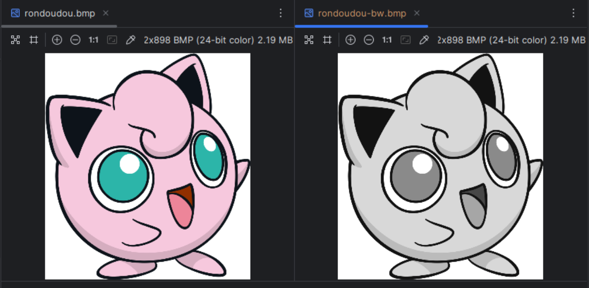
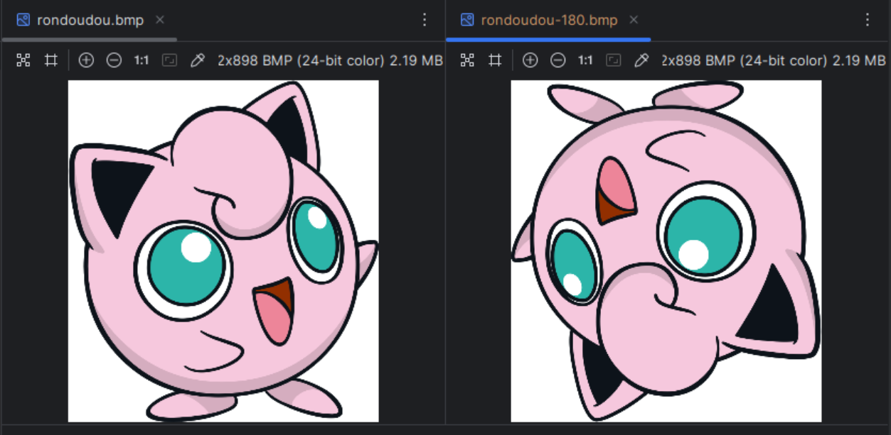

# DAI WORK 1 - éditeur de fichier BMP


## Introduction
L'objectif de cette application en ligne de commande (CLI) est de lire un fichier .bmp et d'y appliquer une transformation (filtre ou rotation) puis de l'écrire dans un nouveau fichier. 

## Table des matières
- [Introduction](#introduction)
- [Table des matières](#table-des-matières)
- [Clone et Build](#clone-et-build)
- [Utilisation](#utilisation)
  - [Contexte](#contexte)
  - [Version du fichier](#version-du-fichier)
  - [Exemple d'utilisation](#exemple-dutilisation)
- [Auteurs](#auteurs)

## Clone et Build
Les étapes suivantes vous permettent de clôner et build le projet afin de pouvoir commencer à l'utiliser. Nous utilisons Maven comme gestionnaire de projet.

Cloner le repo
```
git clone git@github.com:QuentinMichon/dai-work-1.git
```

Rentrer dans le dossier racine
```
cd work-1-BMP-cli/
```

#### Pour Linux / MacOS
Télécharger les dépendances 
```sh
./mvnw dependency:go-offline
```
Générer une archive JAR
```sh
./mvnw clean package
```

#### Pour Windows
Télécharger les dépendances
```sh
./mvnw.cmd dependency:go-offline
```
Générer une archive JAR
```sh
./mvnw.cmd clean package
```

> [!NOTE]
> 
> Si vous utilisez l'IDE Intellij IDEA, vous pouvez run la configuration **Package application as JAR file** afin d'automatisation la création de l'archive.

## Utilisation

### Contexte
Le programme va lire et écrire les images dans le dossier [IOFile/](IOFile). Trois images vous sont fournies afin de faire des tests :
- rondoudou.bmp
- pokeball.bmp
- salameche.bmp

>[!CAUTION]
> 
> Afin de lire une image, il est obligé de placer l'image dans le dossier [IOFile/](IOFile) et qu'elle soit au bon format (voir ci-dessous).

### Version du fichier
Le programme peut gérer qu'un type de fichier avec les caractéristiques suivantes : 
- Type : BMP3 (Microsoft Windows bitmap image V3) 
- Colorspace : sRGB
- Depth : 8-bits (par canal)

Afin de s'assurer la bonne compatibilité des fichiers utilisé, vous pouvez suivre les étapes suivante pour convertir une image .png en .bmp utilisable par le programme.

#### Linux / MacOS
1) Installer ImageMagick
```sh
sudo apt install imagemagick 
```
2) Verifier l'installation
```sh
convert --version
```
3) Convertir l'image PNG en BMP

```sh
convert rondoudou.png -background white -alpha remove -alpha off -type TrueColor +profile "*" BMP3:rondoudou.bmp
```

#### Windows
1) Télécharger le binaire officiel : ImageMagick Download


2) Pendant l’installation, cocher l’option "Add application directory to your system path" pour pouvoir utiliser magick dans l’invite de commande.

3) Verifier l'installation
```sh
magick -version
```
4) Convertir l'image PNG en BMP
```
magick rondoudou.png -background white -alpha remove -alpha off -type TrueColor +profile "*" BMP3:rondoudou.bmp
```

>[!NOTE]
> 
> Avec cette commande, même si l'arrière-plan est transparent, il sera remplacé par un fond blanc.

### Exemple d'utilisation
L'archive .jar se trouve dans le fichier [target/](target/work-1-BMP-cli-1.0-SNAPSHOT.jar). Ouvrez un terminal dans ce dossier afin de pouvoir exécuter les commandes suivantes.

#### Copier-coller
Le programme de base permet de copier-coller une image. Le premier paramètre est le nom du fichier source et le deuxième le nom du fichier de destination.

```sh
java -jar target/work-1-BMP-cli-1.0-SNAPSHOT.jar \
rondoudou.bmp \
rondoudou-copy.bmp
```
#### Filtre
Utilisez la commande **filter** pour appliquer un filtre à l'image. 
Puis, choisir une des options avec -f (BLACK_WHITE ou GAUSSIAN).

```sh
java -jar target/work-1-BMP-cli-1.0-SNAPSHOT.jar \
rondoudou.bmp \
rondoudou-bw.bmp \
filter -f=BLACK_WHITE
```



#### Rotation
Utilisez la commande **rotation** pour appliquer une rotation de sens horaire à l'image. Puis, choisir une des options avec -r
(ROTATE_90, ROTATE_180, ROTATE_270).

```sh
java -jar target/work-1-BMP-cli-1.0-SNAPSHOT.jar \
rondoudou.bmp \
rondoudou-180.bmp \
rotation -r=ROTATE_180
```



## Auteurs
- Quentin Michon
- Gianni Bee
